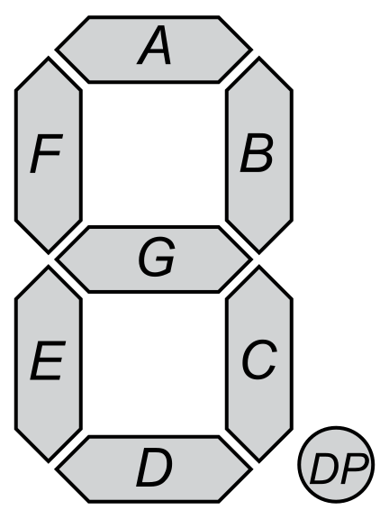

The display is driven by the TM1650 chip, for which there is a library. The
display is connected rather strangely:

 | Segment | TM1650 |
 |:-------:|:------:|
 |    A    |   F    |
 |    B    |   P    |
 |    C    |   C    |
 |    D    |   D    |
 |    E    |   E    |
 |    F    |   G    |
 |    G    |   B    |
 |    P    |   A    |

To display a zero with the regular connections:

    11111100

To display a zero with the connections on this board:

    10111011

So I have added a function to the 
[TM1650 library](https://github.com/arkhipenko/TM1650), that bit shifts things
in to place when writing characters to the display. 